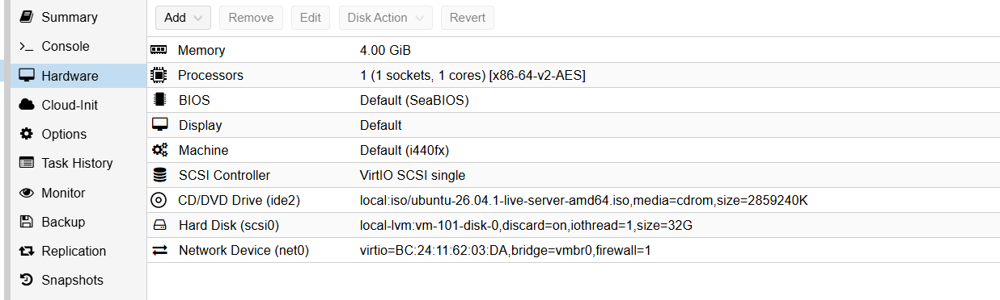
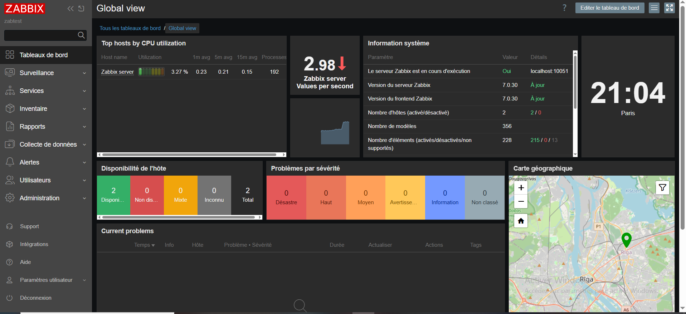
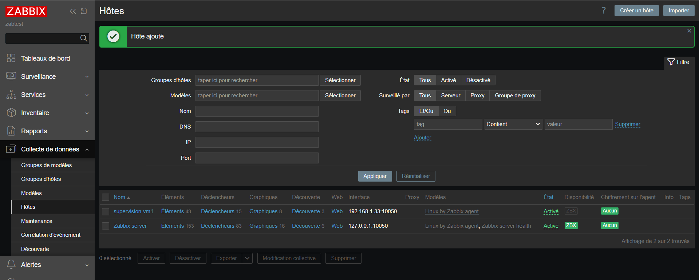
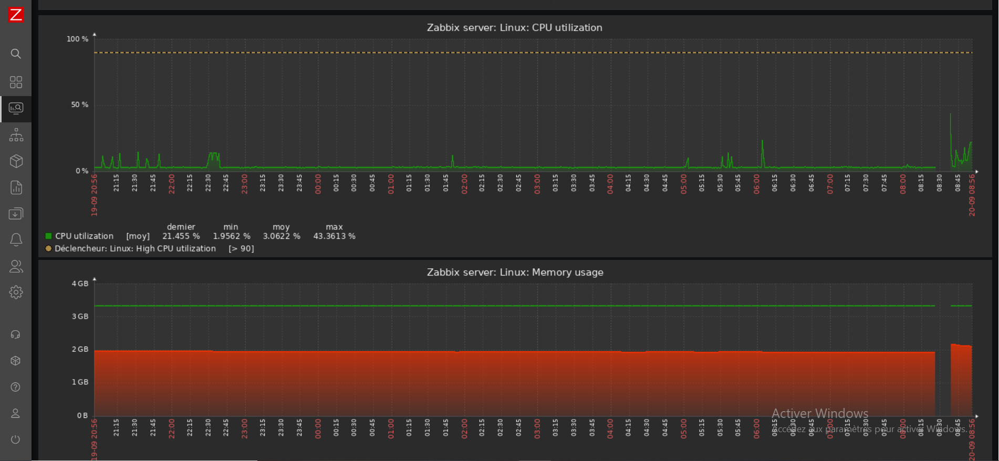
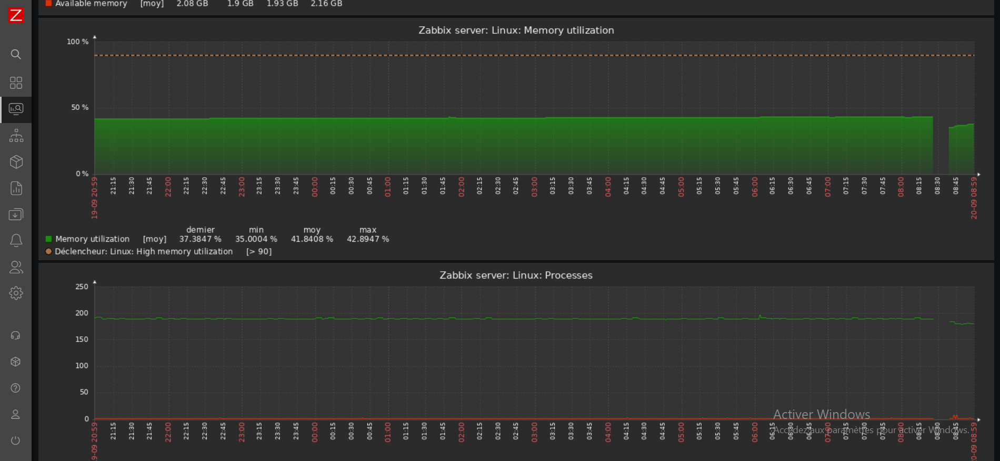

# Homelab

## Objectif
Lab perso pour tester des trucs (Docker, Ansible, Terraform, Vagrant) sans risquer une vraie infra.

## Machine hôte
- CPU : Core i3 (2-4 cœurs) -> le vrai bottleneck
- RAM : 16 Go -> large
- Disque : 512 Go -> large marge (images Docker, snapshots)
- Réseau : à préciser

RAM abondante par rapport au nombre de cœurs dispo. Donc c'est le CPU qui limite en premier dès que 2-3 VMs bossent en même temps, pas la mémoire. Sur une autre machine (plus de cœurs, moins de RAM) ce serait l'inverse.

## Hyperviseur
Proxmox VE. Gratuit, basé Debian/KVM/LXC, cluster inclus (contrairement à ESXi qui veut vCenter payant), backup natif avec PBS.

## Config VMs
| VM | OS | RAM | Socket | Cœurs | Rôle |
|---|---|---|---|---|---|
| VM1 | Ubuntu Server 26.04 | 4 Go | 1 | 1 | Héberge le portfolio (Nginx) |
| VM2 (zabserver) | Ubuntu Server 26.04 | 4 Go | 1 | 1 | Zabbix server (monitoring) |

Total : 8 Go RAM / 2 vCPU, reste ~8 Go pour l'hôte.

Démarrage prudent à 1 cœur/VM. A monter plus tard via Proxmox (Hardware > Processors) si ça sature côté VM sans que l'hôte sature. Nécessite un reboot de la VM (pas de hotplug par défaut).

## Ce qui est déployé

### VM1 - 192.168.1.33
- Ubuntu Server 26.04, OpenSSH installé pour l'admin à distance
- Nginx installé, sert le portfolio (repo GitHub cloné directement sur la VM, copié dans /var/www/html)
- Agent Zabbix installé, configuré pour remonter ses métriques vers VM2

### VM2 (zabserver) - 192.168.1.4
- Ubuntu Server 26.04
- Stack Zabbix 7.0 LTS : zabbix-server-mysql, zabbix-frontend-php, zabbix-apache-conf, zabbix-agent
- MySQL en base de données (base `zabbix`, utilisateur dédié)
- Interface web accessible sur http://192.168.1.4/zabbix
- Surveille VM1 (hôte "supervision-vm1", template Linux by Zabbix agent) et se surveille elle-même

Séparation service/monitoring volontaire : si VM1 plante, VM2 garde l'historique d'avant le crash. Si le monitoring tombe, le portfolio continue de tourner.

## Monitoring (~12h d'historique)
- CPU : moyenne ~3%, pics ponctuels à 10-20% pendant les manips
- RAM : stable entre 35% et 43%
- Processus : stable autour de 190
- Alertes : redémarrage détecté sur les deux VMs, changement du nombre de paquets installés (installs Nginx/Zabbix/MySQL), sévérité "Avertissement" uniquement
- Trou dans les graphiques pendant le redémarrage, Zabbix détecte bien les interruptions

## Backup
PBS. Gratuit, intégré, dédup/compression correctes. Pas encore configuré sur ce lab.

## Limites
- CPU = bottleneck principal
- Disque largement suffisant pour l'OS + VMs + images Docker
- Pas fait pour du K8s multi-nœuds
- Portfolio servi en HTTP simple, pas de certificat SSL pour l'instant

## Idées pour la suite
- TrueNAS Scale pour le stockage
- Tailscale pour l'accès distant
- Automatiser le déploiement du portfolio avec Ansible (playbook réutilisable au lieu du clone/copy manuel)
